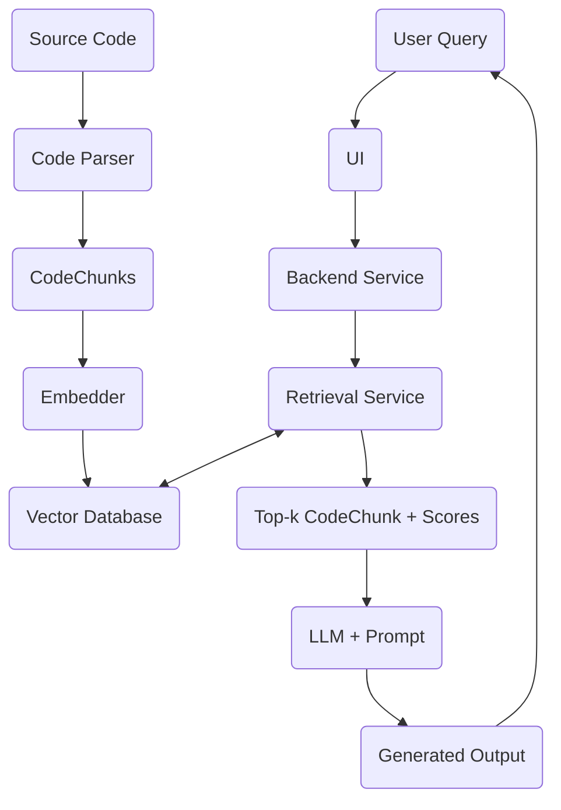

# Codebase RAG

A tool that helps developers and testers understand large codebases through natural-language queries. It leverages **Retrieval-Augmented Generation (RAG)** and a **Graph structure** to give LLMs accurate, citation-backed answers about any repository.

---

## Overview

Instead of reading hundreds of files manually, ask questions like:

> *"Where is login handled?"*
> *"What does AuthService do?"*
> *"Which files should I read to understand the checkout flow?"*

The system scans your codebase, indexes it into a vector database, and retrieves the most relevant code chunks to answer your question — with exact file paths and line numbers.

---

## Architecture


### Layer Responsibilities

| Layer | Module | Responsibility |
|---|---|---|
| Ingestion | `ingestion/` | Scan repo, chunk source files, preserve metadata |
| Retrieval | `retrieval/` + `infrastructure/` | Embed chunks, store vectors, search by query |
| RAG API | `api/` + `rag/` | Build prompt, call LLM, return answer with citations |

---

## Project Structure

```
src/codebase_rag/
├── core/
│   ├── config.py               # All settings via environment variables
│   └── logging.py              # Logging setup (console + JSON modes)
│
├── domain/
│   ├── code_chunk.py           # CodeChunk — shared data model
│   ├── retreival_result.py     # RetrievalResult — search output model
│   ├── embedding_port.py       # IEmbeddingPort — embedder interface
│   └── vector_store.py         # IVectorStore + SearchFilters — store interface
│
├── retrieval/
│   ├── embedding_service.py    # Orchestrates chunk/query embedding
│   └── retrieval_service.py    # Public API — index_chunks() + retrieve()
│
└── infrastructure/
    ├── embedding/
    │   └── sentence_transformers_embedder.py   # BAAI/bge-small-en-v1.5
    └── vectordb/
        └── faiss.py            # In-memory FAISS vector store
```

---

## Quickstart

### 1. Clone and install

```bash
git clone <repo-url>
cd codebase-rag
pip install -e ".[dev]"
```

### 2. Configure

Copy the example env file and edit as needed:

```bash
cp .env.example .env
```

Key settings in `.env`:

```env
EMBEDDING_MODEL_NAME=BAAI/bge-small-en-v1.5
EMBEDDING_BATCH_SIZE=64
DEVICE=cpu
```

### 3. Index a repository

```python
from codebase_rag.core.config import Settings
from codebase_rag.core.logging import setup_logging
from codebase_rag.retrieval.retrieval_service import RetrievalService

setup_logging(level="INFO")
settings = Settings()
service = RetrievalService.from_settings(settings)

# chunks produced by Member 1 ingestion layer
service.index_chunks(chunks)
```

### 4. Query

```python
results = service.retrieve("where is login handled?", top_k=8)

for r in results:
    print(f"[{r.score:.3f}]  {r.file_path}  lines {r.start_line}–{r.end_line}")
    print(r.text[:200])
    print()
```

### 5. Filter by language or file

```python
from codebase_rag.domain.vector_store import SearchFilters

results = service.retrieve(
    query="how is payment processed?",
    top_k=5,
    filters=SearchFilters(language="python"),
)
```

---

## Configuration Reference

All settings are read from environment variables or a `.env` file at the project root.

| Variable | Default | Description |
|---|---|---|
| `EMBEDDING_MODEL_NAME` | `BAAI/bge-small-en-v1.5` | HuggingFace model for embeddings |
| `EMBEDDING_BATCH_SIZE` | `64` | Texts encoded per forward pass |
| `DEVICE` | `cpu` | Torch device (`cpu`, `cuda`, `mps`) |
| `LOG_LEVEL` | `INFO` | Root log level |
| `LOG_JSON` | `false` | JSON structured logs for production |

---

## Development

### Run tests

```bash
# unit tests — fast, no model loaded
pytest src/tests/ -v

# stop on first failure
pytest src/tests/ -x -v
```

### Code style

- **PEP 8** enforced throughout
- **Google-style docstrings** on all public classes and methods
- **Type hints** on every function signature
- `from __future__ import annotations` at the top of every file

---

## Team

| Member | Role | Deliverables |
|---|---|---|
| KienTT59 | Ingestion engineer | File scanner, code chunker, metadata |
| KhangNP4 | Retrieval engineer | Embedder, vector store, `RetrievalService` |
| XuanNV8 | RAG app engineer | FastAPI, LLM answer generation, Streamlit UI |
