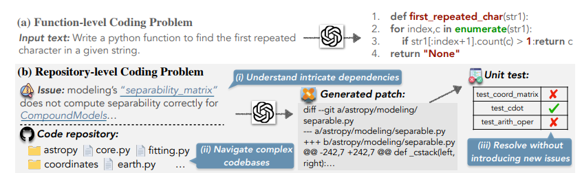
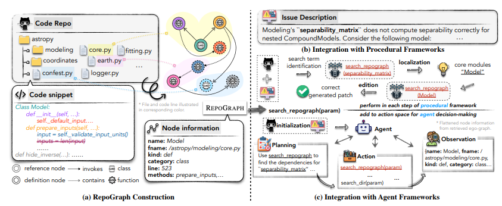
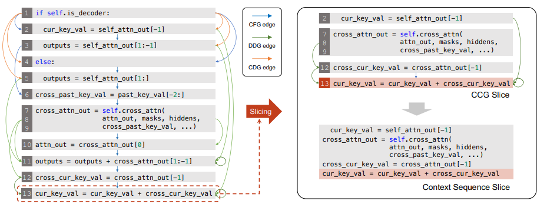
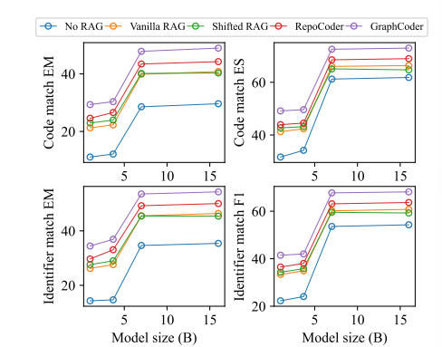

# 1. GraphRAG - A QA system that can help dev/tester understand a large-scale codebase

Bài toán đặt ra là cần xây dựng một tool có thể hỗ trợ tester/dev hiểu được codebase thông qua ngôn ngữ tự nhiên. Chức xoay quanh là có thể hiểu được codebase thông qua các câu truy vấn bằng ngôn ngữ tự nhiên, có khả năng hỗ trợ và trích xuất ra một `Knowledge Graph` thể hiện mối tương quan giữa các `callers` và `callees`. Bên cạnh đó, tool cũng cần được thiết kế sao cho có khả năng hiểu được cách hoạt động của `workflows` bên trong codebase, hiểu được logic và cũng như là xem được các hàm nào đang không dùng trong codebase để xóa đi.

# 2. Survey
## 2.1 [GraphRAG - Reliable Graph-RAG for Codebases: AST-Derived Graphs vs LLM-Extracted Knowledge Graphs](https://arxiv.org/pdf/2601.08773)
## 2.2 Abstract
Paper này đặt ra vấn đề là: 
> RAG trong SWE phải phụ thuộc khá nhiều vào việc vector similarity search dẫn tới là dễ bị fail khi mà các kiến trúc suy luận mà đa bước chẳng hạn như là (controller -> service -> repo chains, ...). 

Trong paper này nó đánh giá 3 pipeline trên một Java Codebase bao gồm:
- **No-Graph Naive RAG**: Chỉ dùng Vector
- **LLM-Generated Knowledge Graph RAG**: Dùng LLM để gen ra một KG. 
- **AST-derived Knowledge Graph RAG**: Xây dựng một `Tree-sitter` để bóc tách thông qua việc quan sát đa hướng.

Họ đã sử dụng một tập cố định gồm **15 kiến trúc** và **các câu truy vấn code-tracing** cho từng repo. Đối với mỗi repo **DKB** họ xây dựng một cái **ontology Graph** với tốc độ được tính theo giây (`2.81s` trên `Schopizer`, `13.77s` trên `ThingsBoard` và `5.60s` trên `OpenMRS Core`).

## 2.3 Cost & Latency Summary

### 2.3.1 End-to-end execution cost

| Workload | No-Graph | DKB | LLM-KB | DKB vs No-Graph | LLM-KB vs No-Graph |
| --- | --- | --- | --- | --- | --- |
| Shopizer | $0.04 | $0.09 | $0.79 | ~2.25x | ~19.75x |
| OpenMRS Core + ThingsBoard | $0.149 | $0.317 | $6.80 | ~2.13x | ~45.64x |

### 2.3.2 Query-time latency

| Workload | No-Graph | DKB | LLM-KB |
| --- | --- | --- | --- |
| Shopizer | 9.52±2.98s | 10.51±4.17s | 13.36±7.87s |
| ThingsBoard | 10.92±1.43s | 11.17±1.97s | 15.29±4.94s |
| OpenMRS Core | 11.82±2.79s | 12.21±6.96s | 11.94±4.88s |

LLM-KB và DKB có các outlier ở worst-case cao hơn trong một số thiết lập.

## 2.4 Related Work
Trước hết, họ định nghĩa bài toán là cho $\mathcal{S}$ là codebase mà ta cần phân tích. $q$ sẽ là câu truy vấn được viết dưới dạng ngôn ngữ tự nhiên về behaviour hoặc là kiến trúc. 

Trong đó hệ thống ta sẽ cần kết hợp từ nhiều $\mathcal{C}(q)$ để có thể trả lời được $q$. 

### 2.4.1 Graph-Based Retrieval Formalization
Ở đây họ mô hình codebase thành một đồ thị có hướng ký hiệu là $G=(V,E)$ trong đó mỗi node $v \in V$ sẽ là các phần tử (classes, interface, etc) và các cạnh $e \in E$ sẽ là mối quan hệ của chúng như (extends, implements, injects).

Đồ thị này sẽ mở rộng các nút truy vấn ban đầu từ tập $V_0$ bằng cách sử dụng neighborhood expansion theo một độ sâu $d$ nào đó xung quanh nút mỗi nút $v$ theo các hướng khác nhau như (nút kế tiếp, nút trước đó hoặc là cả hai).

### 2.4.2 Detail Solution
Ở đây họ sẽ xây dựng `code graph` bằng cách sử dụng **Tree-sitter** ($\texttt{tree\_sitter}$), nó có nhiệm vụ là thêm các cạnh đã được gán nhãn là kế thừa như là ($\texttt{extends/implements}$) cũng như là các **dependency injection patterns** như là `filed` và `constructor para`. Tại thời điểm query nó sẽ tiến hành mở rộng ngữ cảnh bằng các sử dụng `biodirectional` graph `traversal` và mở rộng các mối quan hệ `interface-consumer`.

### 2.4.3 Graph-Aware Retrieval Algorithm
**Algorithm 1. Graph-aware context assembly (bidirectional)**

**Require:** query $q$, vector retriever $R$, graph $G$, depth $d$, top-$k$

1. $D \leftarrow R(q)$  
   - Top-$k$ retrieved chunks
2. $V_0 \leftarrow \mathrm{ENTITIESFROMDOCS}(D)$
3. $V \leftarrow V_0$
4. for $v \in V_0$ do
5. &nbsp;&nbsp;$V \leftarrow V \cup \mathrm{SUCC}(G, v, d) \cup \mathrm{PRED}(G, v, d)$
6. &nbsp;&nbsp;$V \leftarrow V \cup \mathrm{INTERFACECONSUMEREXPAND}(G, v)$  
   - Optional
7. end for
8. return $C(q) \leftarrow \mathrm{ASSEMBLECODECONTEXT}(V)$

## 2.2 [RepoGraph: Enhancing AI Software Engineering with Repository-level Code Graph](https://arxiv.org/abs/2410.14684)

### 2.2.1 Abstract
Bài toán đặt ra làm sao để LLM có thể hiểu được codebase ở repository-level. Vì các phương pháp hiện tại đang thường bỏ qua việc này. Họ đã đề xuất một giải pháp mang tên là `RepoGraph`, là một **plug-in** module được dùng để quản lý các kiến trúc ở cấp độ là toàn bộ repository thay vì là chỉ nhìn vào một file hoặc một folder. 

**Figure 1**: Minh họa về *function-level coding* problem và *repository-level coding* problem.

Ở trong bài báo này họ dã chỉ ra rằng việc chi truy xuất ở `file-level` thì sẽ chỉ có thể xác định về mặt ngữ nghĩa để tiếp tục chỉnh sửa file đó. Và sau đó vào năm 2024 thì có người đã đề xuất thay vì dùng RAG thì sẽ sử dụng `Agentless` xây dựng một bộ xương cho mỗi file và trực tiếp nhắc LLM xác định các file liên quan hoặc đoạn code liên quan. Và giờ đây thì ta có thể thấy được sức mạnh của `LLM Agents` có thể tự do xác định được hành động tiếp theo dựa trên các quan sát tuy nhiên nó vẫn có thể hạn chế là nếu như không hiểu được cấu trúc của toàn dự án thì nó sẽ chỉ tập trung vào một file cụ thể nào đó, dẫn tới là tập trung tối ưu hóa một phần nào đó thôi. 

Để giải quyết bài toán này ta phải nâng cao kỹ thuật để làm sao LLM có thể hiểu sâu thay vì là chỉ so sánh semantic. Điều này sẽ cho phép LLM tập dụng được ngữ cảnh chi tiết thông qua nhiều files, function calls và tạo điều kiện để đưa ra các quyết định liên quan tới codebase.

Do đó họ đề xuất `RepoGraph` là một **plug-in** module được thiết kế để hỗ trợ LLM-based AI Programmer hiểu được cấu trúc dự án và code trong một dự án nào đó. Đây là một **graph-structure** và tổ chức ở dưới **line level** cung cấp một cách tiếp cận chi tiết hơn các phương pháp cũ. 

Điều đặc biệt ở đây là *mỗi node chính là một dòng code* và mỗi cạnh sẽ biểu diễn sự phụ thuộc giữa các định nghĩa và tham chiếu.`RepoGraph` được tổ chức bằng cách khởi tạo một **code line parsing** và mã hóa **code representation** của dự án hiện tại. Họ còn đề xuất một thuật toán để **Truy vấn Sub-Graph** được sử dụng để trích xuất các `ego-graphs` điều này giúp cho ta có thể biểu diễn được mối quan hệ của một node trung tâm nào đó. Và `ego-graphs` có thể tích hợp dễ dàng vào các frameworks của agent, cho phép kết nối từ khoa để tạo ra một ngữ cảnh đầy đủ cho LLM.

**Figure 2**: Một bức tranh về *(a) Quá trình khởi tạo, (b) Quá trình tích hợp các framework thủ tục và (c) Tích hợp với Agent Framework.

#### 2.2.2 Results of RepoGraph

*Accuracy metrics are taken from the leaderboard; cost metrics are computed from the corresponding trajectories.*

| Group | Methods | LLM | resolve | # samples | patch apply | $ cost | # tokens |
| --- | --- | --- | ---: | ---: | ---: | ---: | ---: |
| **Procedural frameworks** | RAG | GPT-4 | 2.67 | 8 | 29.33 | $0.13 | 11,736 |
|  | +RepoGraph | GPT-4 | 5.33 (+2.66) | 16 (+8) | 47.67 (+18.34) | $0.17 | 15,439 |
|  | Agentless | GPT-4o | 27.33 | 82 | 97.33 | $0.34 | 42,376 |
|  | +RepoGraph | GPT-4o | 29.67 (+2.34) | 89 (+7) | 98.00 (+0.67) | $0.39 | 47,323 |
| **Agent frameworks** | AutoCodeRover | GPT-4 | 19.00 | 57 | 83.00 | $0.45 | 38,663 |
|  | +RepoGraph | GPT-4 | 21.33 (+2.33) | 64 (+7) | 86.67 (+3.67) | $0.58 | 45,112 |
|  | SWE-agent | GPT-4o | 18.33 | 55 | 87.00 | $2.53 | 498,346 |
|  | +RepoGraph | GPT-4o | 20.33 (+2.00) | 61 (+6) | 90.33 (+3.33) | $2.69 | 518,792 |

Thông qua bảng trên tác giả đã chỉ **4 điểm chính** như sau:

- **RepoGraph** đã mang tới một kết quả nhất quán trên tất cả các tổ hợp framework và  LLm model khác nhau. Có sự vượt trội trong tỷ lệ tuyệt đối giải quyết công việc $+2.66\$$ và $+2.34\$$ lần lượt cho RAG và Agentless. Và tăng $99.63\%$ và $8.56\%$ ở tỷ lệ tương đối cho hai phương pháp trên. 
- **Hiệu suất tăng từ RepoGraph đã lớn hơn chút xíu trên procedural frameworks so với agent frameworks**.
- **Hiệu suất tăng nhưng không đòi hỏi phải tăng chi phí**. 
- **Chi phí trung bình thông thường sẽ cao hơn agent framework cho RepoGraph**. Điều này bởi vì là RepoGraph cho agent tự do xác định hành động kế tiếp trong trạng thái quan sát hiện tại. Và họ cũng chứng minh rằng tích hợp với agent framework thông thường dẫn tới chi phí tăng lên chút xíu chỉ khoảng $+0.13\$$ và $+0.18\$$ đối với `AutoCodeRover` và `SWE-agent`. 

## 2.3 [GraphCoder: Enhancing Repository-Level Code Completion via Code Context Graph-based Retrieval and Language Model](https://arxiv.org/pdf/2406.07003)

### 2.3.1 Abstract
Bài toán đặt ra là LLM có khả năng khá tốt trên các tác vụ coding thông thường nhưng nó lại bị thường xuyên không đủ tốt trong việc coding ở repository-level bởi vì nó thiếu đi ngữ cảnh và kiến thức. Để giải quyết được điều này, các tác giả đã đề xuất `GraphCoder` là một framework được xây dựng dựa trên RAG cho tác vụ **code completion**. Nó tận dụng khả năng của LLM cho các kiến thúc code thông thường và kiến thức cụ thể của một dự án bất kỳ thông qua `graph-based retrieval-generation` process. 

Thực tế rằng `GraphCoder` có khả năng nắm bắt được ngữ cảnh của mục tiêu cần làm chính xác hơn thông qua `code context graph (CCG)` bao gồm **control-flow, data-control dependence** giữa các dòng code với nhau. Và dựa trên `CCG` `GraphCoder` còn có khả năng triển khai một quá trình truy vấn từ **coarse-to-fine** để xác định được đoạn code có sự tương đồng với ngữ cảnh. 

### 2.3.2 Related Work
Trong bài báo này, họ tận dụng RAG cho `repository-level` nhưng khám phá một style có cấu trúc hơn để xác định các đoạn code liên quan trong tác vụ **completion task**. `GraphCoder` ý tưởng chính của nó chính là nắm bắt được ngữ cảnh của **completion task** bằng cách tận dụng các thông tinc ó cấu trúc trong một source code thông qua các **artifact** được gọi là `code graph context (CCG)`. Đây chính là một `multi-graph` được xây dựng ở cấp độ là `statement` cho các node và edge, được đặt tên là `control flow`. 

Việc sử dụng `CCG` có tác dụng để có thể nâng cao độ hiệu quả trong việc truy vấn trong ba khía cạnh sau: 
1. Thayd dổi các dạng biểu diễn của code theo dạng chuỗi thành một **dạng biểu diễn có cấu trúc** để nắm bắt được các ngữ cảnh liên quan. 
2. Tăng cường sự tương đồng ở mức độ `sequence-based` để xác định mức độ giống nhau theo chiều sâu.
3. Áp dụng sự tương đồng theo khoảng cách để có thể đo lường sự khác biệt giữa các context statement khác nhau. 

### 2.3.3 Code Context Graph 
Đây là sự kết hợp từ 3 loại đồ thị về code: 
- **control flow graph (CFG)**
- **Control dependence graph (CDG)**
- **Data dependence graph (DDG)**

Do đó họ định nghĩa rằng:
> Một `Code Context Graph` là một đồ thị đa hướng ký hiệu là $G=(X, E, T, \lambda)$. Trong đó tập $X$ chính là tập đỉnh, mỗi đỉnh tượng trưng cho **code statement** hoặc là một tiên đề. Tập $E$ chính là tập cạnh, mỗi cạnh chính là một bộ ba $(x_i, t, x_j)$ trong đó $x_i, x_j$ chính là một đinh $x \in X$ và $t \in T$ chính là kiểu của cạnh đó. $T = {CF, CD, DD}$ là một trong các loại đồ thị được liệt kê ở đầu. Và cuối cùng chính là $\lambda$ được dùng để ánh xạ các cạnh trong E về loại của nó. 

**Control Flow Graphs (CFG)** cung cấp một dạng biểu diễn chi tiết của thứ tự mà các statements được thự thi. Mỗi đỉnh chính là một `statements` hoặc `predicates`. Mỗi cạnh là sự di chuyển giữa các statements bao gồm các **sequential execution, jumps** và **iterative loops**. Việc xây dựng CFG dựa trên một `abstract syntax tree (AST)`.

**Control Dependence Graphs (CDG)** tập trung vào việc xác định **control dependencies** giữa các node với các cạnh được dùng để nhấn mạnh sự ảnh hưởng trực tiếp của một statement trên sự thực thi của một statement khác. Đặc biệt là một cạnh tồn tại giữa hai statements chỉ khi một thằng ảnh hưởng trực tiếp lên sự thực thi được dùng để phân biệt với CFG. 

**Data Dependence graphs (DDG)** được dùng để phản ánh sự phụ thuộc giữa việc gán biến và tham chiếu, mà tại đó các cạnh biểu diễn rằng có một biến được định nghĩa bên trong một statement được sử dụng bởi một thằng khác. Đồ thị này được tạo thông qua hai quá trình **hai bước** đó là: Đầu tiên ta sẽ xác định tập các biến được định nghĩa và được sử dụng bởi các statement. Thứ hai là đối với một biến trong tập $v$ thì các các cạnh được khởi tạo khi mà tồn tại một đường đi CFG từ statement định nghĩa $v$ tới statement sử dụng $v$. 

$$
\begin{aligned}
&\textbf{Algorithm 1: CCG Slicing}\\
&\textbf{Input: }\;\text{CCG graph }G=(X,E,T,\lambda),\;\tilde{x}\in X,\;\text{max hops }h,\;\text{max statements }l\\
&\textbf{Output: }\;\text{A CCG slicing graph }G^{l}_{h}(\tilde{x})\\
&1.\;\;X_{CD},X_{CF},X_{DD}\leftarrow\varnothing\\
&2.\;\;\text{push }\tilde{x}\;\text{into an empty queue }q;\\
&3.\;\;\text{while }q\;\text{is not empty do}\\
&4.\;\;\;\;x\leftarrow q.\text{pop}();\\
&5.\;\;\;\;\text{if }x\;\text{exceeds }h\;\text{hops from }\tilde{x}\;\text{then break;}\\
&6.\;\;\;\;X_{CF}\leftarrow X_{CF}\cup\{x\};\\
&7.\;\;\;\;X_{DD}\leftarrow X_{DD}\cup\{z\mid (z,DD,x)\in E\};\\
&8.\;\;\;\;X_{CD}\leftarrow X_{CD}\cup\{z\mid (z,CD,x)\in E\};\\
&9.\;\;\;\;\text{if }|X_{CF}\cup X_{CD}\cup X_{DD}|\ge l\;\text{then break;}\\
&10.\;\;\;\;\text{for }z\in\{z\mid (z,CF,x)\in E,\;z\notin X_{CF}\}\;\text{do}\\
&11.\;\;\;\;\;\;\text{if }z\;\text{has not been visited by }q\;\text{then }q.\text{push}(z);\\
&12.\;\;\;\;\text{end for}\\
&13.\;\;\text{end while}\\
&14.\;\;G^{l}_{h}(\tilde{x})\leftarrow G[X_{CF}\cup X_{DD}\cup X_{CD}];\\
&15.\;\;\text{return }G^{l}_{h}(\tilde{x})
\end{aligned}
$$

### 2.3.4 Result
**Table 3**: Ablation study of components in CCG

| Level | Language | Component | Code Match EM | Code Match ES | Identifier Match EM | Identifier Match F1 |
| --- | --- | --- | ---: | ---: | ---: | ---: |
| Line level | Python | GraphCoder | 46.60 | 69.42 | 53.80 | 65.55 |
|  |  | - CFG | 39.15 | 62.93 | 47.10 | 53.93 |
|  |  | - DDG | 42.05 | 64.96 | 49.85 | 56.21 |
|  |  | - CDG | 41.70 | 64.89 | 49.50 | 56.16 |
| Line level | Java | GraphCoder | 50.60 | 78.94 | 58.70 | 72.00 |
|  |  | - CFG | 45.07 | 77.10 | 54.18 | 69.67 |
|  |  | - DDG | 47.62 | 77.66 | 56.20 | 70.27 |
|  |  | - CDG | 47.56 | 77.62 | 56.09 | 70.26 |
| API level | Python | GraphCoder | 45.25 | 66.81 | 48.80 | 65.70 |
|  |  | - CFG | 35.90 | 61.01 | 42.40 | 51.65 |
|  |  | - DDG | 39.80 | 63.51 | 46.40 | 54.66 |
|  |  | - CDG | 39.60 | 63.11 | 46.20 | 54.27 |
| API level | Java | GraphCoder | 61.57 | 82.66 | 63.72 | 77.68 |
|  |  | - CFG | 42.06 | 73.90 | 45.06 | 66.19 |
|  |  | - DDG | 56.62 | 79.72 | 58.77 | 75.77 |
|  |  | - CDG | 56.36 | 79.61 | 58.62 | 75.69 |
**Figure 3:** Ví dụ về Code Context Graph và CCG Slice với statement.

**Figure 4**: Độ hiệu quả của các pipline dựa trên kích cỡ của model.

## 2.4 [Dataflow-Guided Retrieval Augmentation for Repository-Level
Code Completion](https://aclanthology.org/2024.acl-long.431.pdf)

### 2.4.1 Abstract
Bài toán đặt ra việc coding bằng LLMs vẫn còn khá nhiều thử thách đặt biệt là tác vụ **compleeting code** trong một private repository. Trong paper này họ đề xuất một `dataflow-guided RAG` được gọi là `DraCo` dùng đẻ phân tách một private repository thành các `code entities` và khởi tạo mối quan hệ của chúng thông qua các **dataflow analysis** được gọi là `repo-specific context graph`. `DraCo` sẽ truy vấn chính xác các background knowledge từ một `repo-specific context graph` và sinh ra các prompt tối ưu để query code LMs.

### 2.4.2 Repo-Specific Context Graph
Đối với mỗi file code trong một repo, họ đã traverse `Abstract Syntax Tree` để thu thập các code entities bao gồm các modules, classes, functions và các biến.

**Module Entity**

| Property | Kiểu | Mô tả |
| --- | --- | --- |
| file_path | string | Đường dẫn đầy đủ của file code |
| docstring | string | Tài liệu/ghi chú của module |

**Class Entity**

| Property | Kiểu | Mô tả |
| --- | --- | --- |
| name | string | Tên của class |
| signature | string | Chữ ký của class (bao gồm kế thừa) |
| docstring | string | Tài liệu/ghi chú của class |
| starting_line_number | int | Số dòng bắt đầu trong file |

**Function Entity**

| Property | Kiểu | Mô tả |
| --- | --- | --- |
| name | string | Tên của hàm/method |
| signature | string | Chữ ký của hàm (bao gồm tham số) |
| docstring | string | Tài liệu/ghi chú của hàm |
| body | string | Nội dung/code của hàm |
| starting_line_number | int | Số dòng bắt đầu trong file |

**Variable Entity**

| Property | Kiểu | Mô tả |
| --- | --- | --- |
| name | string | Tên của biến |
| statement | string | Câu lệnh/dòng code chứa biến |
| starting_line_number | int | Số dòng bắt đầu trong file |

Và dựa trên **type-sensitive relations** trong DFG, họ đã khởi tạo mối quan hệ `depends` giữa các cặp entities với nhau trong mỗi module riêng biệt. Và thậm chí họ còn khởi tạo mối quan hệ này cho các biến bên trong một local $\texttt{import}$ statements và poiting entities trong module khác. Họ tập trung vào năm mối quan hệ chính đó là:
- **Assigns**: Mối quan hệ phản hồi 1-1 trong một statement được dùng khởi tạo hoặc thay đổi giá trị biến.
- **As**: Mối quan hệ xuất phát từ $\texttt{from}$ và $\texttt{except}$ statements và tương tự với mối quan hệ assigns.
- **Refers**: Mối quan hệ biểu diễn sự tham chiếu tới một biến đã tồn tại hoặc thuộc tính của nó. 
- **Typeof**: Mối quan hệ từ việc `type hints` được viết bởi con người để chỉ định kiểu dữ liệu của **return value** của một biến hoặc một hàm. 
- **Inherits**: Mối quan hệ được hiểu là sự phụ thuộc dữ liệu bởi các `subclass` kế thừa tất cả class thành viên từ base.

`DFG` là một đồ thị có hướng không chu trình không đồng nhất (tức có nhiều node nhiều cạnh khác loại) được ký hiệu là $G = {(h, r, t) | h, t \in E, r \in R}$ trong đó $E$ là tập entity, $R$ là tập mối quan hệ `type-sensitive` và một bộ ba $(h, r, t)$ biểu diễn một head entity $h$ trỏ tới thực thể cuối $t$ thông qua mối quan hệ $r$.

## 2.5 [LARGER: Lexically Anchored Repository Graph Exploration and Retrieval](https://arxiv.org/pdf/2605.16352)

### 2.5.1 Abstract
